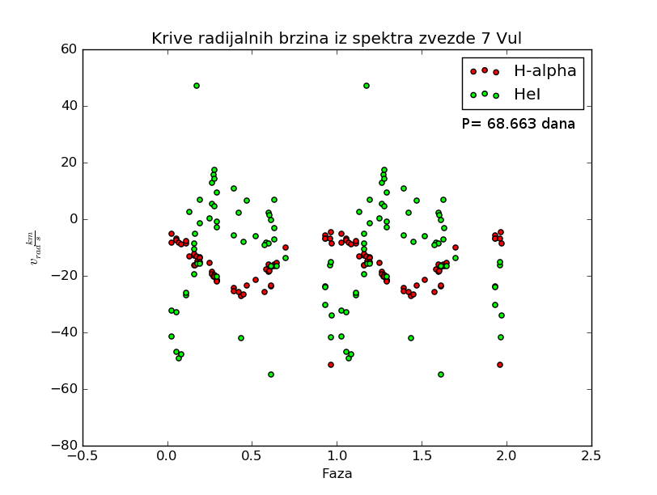

Redukcija spektara u IRAF-u 
#######################################

:date: 2016-05-20 09:15
:slug: iraf-spec 
:author: Lazar Zivadinovic 
:summary: Kratak pregled o redukciji spektara u paketu IRAF 

IRAF folder mozete skinuti ovde.

Pre svega, ovo je jako šturo i neformalno i služi kao podsetnik.

Suviše sam lenj da bih sređivao i da bih pravio "skriptu" ili tako nešto.

U folderu "raw_data" se nalaze sirovi snimci na kojima nije vrsena nikakva redukcija.

Prva redukcija koja je izvrsena je redukcija overscan-a. Overscan predstavlja piksele na ivici CCD kamere na kojima nije zabelezen nikakav podatak. Ova redukcija je izvrsena fitovanjem svih podataka, tj podataka iz svih redova, na nivo overscan-a.

Ovo je radjeno funkcijom fit1d koja je pozivana komandom "epar fit1d"

Nakon redukcije lazne nule, sledeca uradjena stvar je kombinovanje svih bias snimaka u master_bias snimak. Ovo je radjeno komandom "epar imcombine" gde smo selektovali prvih 10 slika iz naseg seta podataka, jer su one bias.

Sledeca izvrsena korekcija je oduzimanje master_bias.fit od svih snimaka.

Ovo radimo zato sto bias predstavlja sum samog cipa. Bias snimak se izradjuje tako sto napravimo snimak sa nultom ekspozicijom.

Drugi naziv sa bias je i read out noise. #Ja ga tako zovem :D
Ova korekcija je izvrsena funkcijom "epar imartih".

Sledeca izvrsena redukcija je trimovanje. Ovo se se izvrsava zbog toga sto nas spektar nece biti snimljen na celom CCD cipu, vec na nekom uskom delu redova. Trimovanjem izbacujemo regione koji ne nose nikakvu informaciju i ostaje nam samo spektar.

Naredna uradjena stvar je pravljenje master flat field snimka. Flat field nam govori o raspodeli osetljivosti razlicitih regiona na svetlost. Snimak je izradjen spajanjem svih flat snimaka (kao i kod bias snimaka). Flat field snimci su snimci sa nazivom [* 19.fit- * 025.fit]. Zatim, je uredjeno usrednjavanje flat field snimka. Ono je vrseno iz razloga jer osetljivost cipa varira u zavisnosti od talasne duzine svetlosti.

Ovo je radjeno deljenjem intenziteta svakog piksela srednjom osetljivoscu cipa. Srednja vrednost je odredjena funkcijom imstat i iznosi 14588 (count's - jedinica)

Nakon normalizovanja master_flat snimka, snimci spektara i komparacionih lampi su redukovani gore usrednjenim flat field snimkom.

Zatim je vrseno raspakivanje spektara funkcijom apextract (podesavanje logova) i apall iz paketa twood. Ovde sam naisao na problem o kom pise vise u fajlu "bag_sa_warning_all_pixel_rejected". Probao sam da popravim kod ovom korekcijom, ali sam dobio invertovane snimke iz nekog razloga. Ne znam sta se tu desavalo, zato sam nastavio da trazim dalje.

Takodje, ispostavilo se da program ne pronalazi automatski pozadinu koju je potrebno oduzeti. (pogledati spaceman prirucnik) Zato su promenjeni parametri b_sampl = -70:-10, 10:70 kao i funkcija za fitovanje
Korisceni parametri se nalaze u slikama raspakivanje_zvezde* kao i raspakivanje_lampi*. Takodje, snimljeni su i log fajlovi, za koje nisam siguran na koje vreme se odnose. Najsigurnije je gledati po timestamp-u. Skoro sigurno su logovi za lampe i zvezde u fajlu log_za_spektre.log posmatrati poslednjih 6 redukovanih fajlova.

Sada imamo kako izgleda raspodela spektara po pikselima, ali nama to nije od koristi. Mi zelimo da dobijemo raspodelu spektra po talasnim duzinama. Zato imamo kalibracione lampe i cilj je kalibrisati nase spektre.

Posto imamo snimljene spektre nasih lampi, zelimo da odredimo na kojoj se talasnoj duzini nalaze linije iz tog spektra. Ovo radimo tako sto odemo na bazu podataka ovde_  (Torijum-Argonska lampa) i izaberemo odredjeni opseg talasnih duzina (6255 - 6767 A) (vizuelna inspekcija). Takodje, spektar nase lampe postoji u datoteci thar.dat koja se nalazi u folderu /iraf/noao/lib/linelists. Identifikaciju vrsimo pokretanjem funkcije identify sa prefiksom epar. Ova funkcija se nalazi u paketu oned.

.. _ovde: http://www.noao.edu/kpno/specatlas/that/thar.html

Ok, nekako sam uspeo da uradim prebacivanje sa piksela na talasne duzine.
#Now, only God knows

Problem je bio sa malim brojem postavljenih linija. Ovo mi je bilo jako cudno i zato sto nasa kalibraciona lampa ne daje isti fluks kao i komparacioni spektar pa nisam mogao da nadjem sta je sta tu.

normalizovao sam spektre funkciojom conti

uradio sam telusku korekciju koristeci template_27vul.fits (Onicev fajl)
#Ovde je bio plan da se nadje model zvezdane atmosfere i da se na osnovu toga odrede telurske linije.
#Problem je bio sa tim sto Fluks na modelu nije bio kalibrisan pa prilikom sredjivanja template-a za telurske linije, dobijemo emisiju.
#Smatram da ako bih to sredio, da bi radilo bas fino...
#P.S. Obratiti paznju na to da model mora da se pomeri za dlambda zbog toga sto mi snimamo shiftovane linije, dok model daje "apsolutne" 

za * 15.fits V korekciono je -22 km/s
za * 30.fits V korekciono je -22.15 km/s
Ovo je baricentricna korekcija

talasne duzine H alpha
15.fits = 6563.04 A
30.fits = 6562.95 A

H alpha (realno) = 6562.81 A
c = 299.92.458 km/s

Radijalna brzina posle korekcija za h alpha
15.fits = −11,493484446 km/s
30.fits = −14,384314591 km/s

A za helijum

15.fits = −19,532823708 km/s
30.fits = −20,879569656 km/s

Ovaj HeI je jako cudan zato sto spekatr nije lepo ociscen i pravi problem prilkom fitovanja (bilo da fitujem gausom, lorencom ili fojtom).

Period je odredjen preko neke skripte koja je pisana za gnuoctave, nisam dublje zalazio u to, samo mi je ispljunulo broj (P=68.663d).

Na kraju krajeva, iskoristio sam podatke iz fajla conti koji sadrzi vrednosti za sva posmatranja i sve ih na istu fazu.

Sve se to lepo plotovalo (rasulo, hehe) i dobili smo ovaj grafik i zakljucili da je zvezda spektroskopsi dvojna.

THE END!

