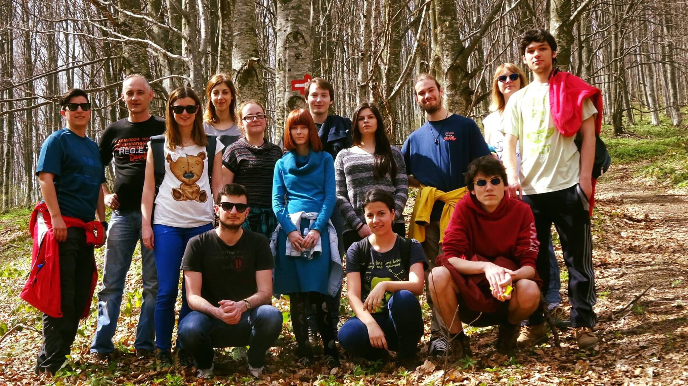
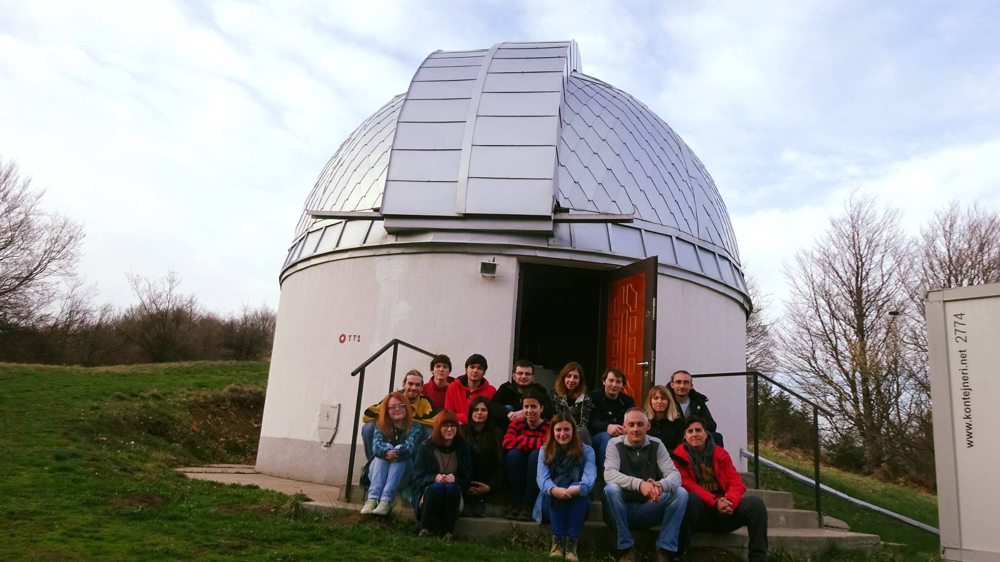

SVAP 2016 - Pa nećemo valjda to 
###############################

:date: 2016-04-03 10:20
:slug: SVAP-2016
:author: Lazar Zivadinovic 
:summary: Utisci sa SVAP-a 2016 

Pišem....

Krenulo je vrlo entuzijastično, tako se i završilo. Ne zbog rezultata, već zbog volje. Jako je tužno to što smo raspoloženi za snimanje čak i kada je oblačno (bili su cirusi, ali smatram da bi radili i po kumulusima) i još tužnije što je sistem snimanja toliko banalizovan da bukvalno kliknes na dva gumba (hehe) i on ti odradi posao. Tu, realno, ima malo mesta za neku preterano veliku grešku ali neko mora da ostane da pazi na klince. Jako mi je žao tog čoveka. Delovao je kao da mu se srce cepa zbog oblačnosti i da bi najviše voleo da dečurlija bude srećna, a sa druge strane zbog iskustva zna da su snimci za ovo veče beskorisni ali želi da nam učini i da deci malo podigne moral.

Drugi dan je bio organizovan kao jako loša Petnička radionica. Mislim, svakako da se metoda najbrže uči kada se ti koristiš softver i kada testiraš šta može da se uradi u njemu, ali smatram da mora da postoji neko predavanje koje se tiče striktno cilja i zašto nam je obrada bitna i šta zapravo mi merimo (o "zbog čega merimo" recimo, sjaj cefeide i šta želimo da zaključimo o fizici iza toga). Astronomi/astrofizičari nisu slušali ORM i smatram to fundamentalno pogrešnim. Mi, astronomi/astrofizičari, nemamo mogućnost eksperimenta, a svaka prirodna nauka se zasniva na činjenici da ti proveriš teoriju tako što je izmeriš, testiraš. Tako da se jedini pristup testiranju astro teorija vrši isključivo posmatranjem, a ne čačkanjem u labi, a ako imate loša merenja i OBRADU URADITE PO ALGORITMU vi zapravo ne znate šta vam ta merenja govore i time ne možete da tvrdite da ste razumeli/potvrdili teoriju.

Takođe potrošiš puno sati na "ajd da pripremim posmatranje za svaki slučaj" i organizujete plan, popunite sve što može za jedno veče i kao ovo je spisak, ovo se radi. I onda ti vreme pomrsi konce i svede se priča na ajd da klikćemo uzaludno da kažemo da smo koristili teleskop.

Jako je bitno da su ljudi raspoloženi za rad sa studentima jer im treba pomoć i ako već instrument bleji tu, zašto mladi ljudi pred kojima je dug put u nauci ne nauče malo bolje to i da se ispraksiraju i tako da budu u prednosti. Stvar je što smo mi lenji ili samo imamo puno obaveza (makar mislimo). Samo nismo lepo organizovani. Nedovoljno entuzijazma za "meni je to potrebno, koje god podatke da koristim moram znati kako se došlo do njih i kako bih mogao da "ponovim eksperiment"

P.S. "Ova slika nije loša" - možda zato što nikada nismo videli bolju.

Loši uslovi + nemanje pojma o merenjima (klikni a, pa b i dobićeš nešto) + entuzijazam =  SVAP 2016

Prvi dan je bio smireniji zato što smo imali priču o detektorima i to predavanje je bilo korisno. Malo filozofije nauke i puno oblaka. Čim ti neko jasno stavi do znanja nešto (neš fotkat klinac) onda ti nekako bude lakše. Ne nadaš se. Bilo da je to zbog, nismo planirali večeras, ili kiša će upropastiti teleskop, vlažnost je prevelika itd. apsolutno nije bitno. Znaš da neš fotkat. 

Lažni utisak atmosfere se može videti na slici 1. Kao što se može videti, puni smo entuzijazma (LOL) ali "deep down" znamo da će ispasti oblačno.

Nije mi krivo što je tako ispalo. Možda smo to i zaslužili.

P.S. M66 + oblaci (cista obrada u MaximDL-u bez fotoshopiranja)

M66 + oblaci

.. image:: ../images/svap_2016/M66.png

Lazar Živadinović

3.4.2016
