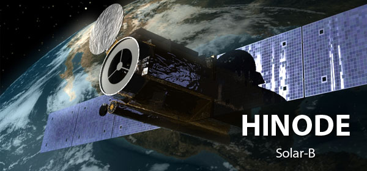

About 
#######################################

:date: 2016-05-14 09:13
:slug: about 
:authors: Lazar Zivadinovic 

Student sam astrofizike na matematičkom fakultetu u Beogradu. Što znači da sam studije upisao (preturam po sobi i tražim indeks) 2013. Pre toga sam išao u Gimnaziju u Kruševcu.

Trenutno "radim" u Istraživačkoj Stanici Petnica (ISP) kao mlađi saradnik na seminaru astronomije.

Takodje radim kao Junior DevOps u ITEkako. 

Kao polaznik u ISP sam radio sa Ivanom Milićem na projektu "Distribucija temperature u aktivnom regionu Sunčeve površine". Moglo bi se reći da sam tada zavoleo Sunce. Sada učim o spektropolarimetrijskim podacima i šta sve može da se radi sa njima.

Omiljeni teleskop - HINODE

It's big and shiny and it's studying Sun...

Big time linux fan/user.

Programiram u pythonu, znam malo C/C++, IDL i bash/zsh shell scripting.

Ovo treba doraditi, dodati CV i slicno. TBD
